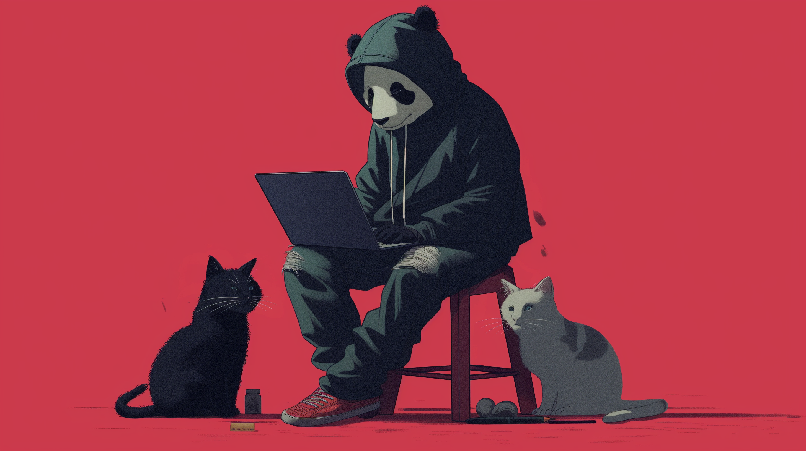
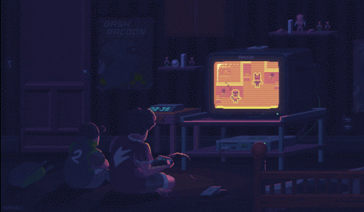

# <p align="center">  Welcome to DaPanda's Coding Den!  </p>



## About DaPanda 

I’m hard of hearing  , an **avid gamer**, a **proud nerd** , with a taste for **old-era music** and the thrills of **snowboarding**. Coding for me is like a game, each line of code a puzzle piece, each project - a quest.

Coffee is my potion, my elixir for those non-morning vibes — without it, the code remains encrypted, and the bugs, undefeated. A cuppa joe is the first quest of my day, leading to a chain of creativity.
I cherish the calmness of cats, the soulfulness of lofi, and the challenge of web development. Though my journey has just begun, my resolve is strong, and my quest log is never empty.

## My Coding Mantra

<table align="center" style="margin-left: auto; margin-right: auto; width: 80%;">
  <tr>
    <td align="center">

```js
if (brain != empty) {
    keepCoding();
} else {
    orderCoffee();
}
```
</td>
<td>
  
  
  Life's motto? **Ride, Drink, Play, Code, Lime it** and repeat... 
</td>
</table>


## 🐾 My Coding Journey

🐾 Started with HTML & CSS  
🐾 Picked up JavaScript & Python  
🐾 Entered the world of **React, TypeScript & Next.js**  
🐾 Participated in the **Codedex Summer Hackathon**  
🐾 Built **CTRL-Purr** for the **Codedex Winter Hackathon**, tying for 3rd place  
🐾 Currently deep into **AI + 3D Motion Generation**, MDM pipelines & tool development  
🐾 Still so much to explore and learn — both in full-stack development and 3D motion.

## 🎋 Some of my Projects

### [Diablo.trade](https://diablo.trade)
A real-time Diablo IV trading marketplace used by over 600,000 players.  
Built with **Next.js, TypeScript, TRPC, MongoDB, Mongoose, Centrifugo**, and a complete internal moderation & admin system.  

### [Sanctuary Staff Bot](https://discord.com/invite/diablo4)
Custom-built tools and integrations for the **500,000+ member** Diablo IV Discord server.  
Includes automated reports, flagged message monitoring, role management, case logs, filters, analytics, and internal dashboards.


### **GenMotionAI — 3D Text-to-Motion Platform**
A closed-beta AI motion generation tool for game devs, VTubers, and content creators.  
Assisting with UI/UX, prompt systems, filters, admin tools, Atlas MongoDB Charts monitoring, motion previewing, and integration with MDM pipelines.

### 🐼 Other Projects

* **[My Coding Den](https://github.com/DaPandamonium/My-Coding-Den)**
  A personal website showcasing my journey and projects.

* **[Chronicles of Eldoria](https://github.com/DaPandamonium/Chronicles-of-Eldoria)**
  A text-based fantasy adventure game full of lore & exploration.

* **[Panda Facts](https://github.com/DaPandamonium/Panda-Facts)**
  Generates fun panda facts for panda enjoyers.

* **[Murder Mystery Discord Bot](https://github.com/DaPandamonium/murderer_bot)**
  A Cluedo-inspired mystery-solving Discord bot.

* **[Harry Potter Zodiac Quiz](https://github.com/DaPandamonium/Harry-Potter-Horoscope)**
  A magical Hogwarts-themed personality quiz.

* **[Zen Desk](https://github.com/DaPandamonium/ZenDesk)**
  A productivity toolkit — Pomodoro, Notes, Habits, To-do, Reminders.


## Skills & Tools 
<table align="center">
  <tr>
    <td valign="top" width="50%">
      <h4>Knowledges | Learning</h4>
      <a href="https://skillicons.dev">
        
      </a>
    </td>
    <td valign="top" width="50%">
      <h4>Tools</h4>
      <a href="https://skillicons.dev">
        
      </a>
    </td>

  </tr>
</table>


## Gaming & Hobbies 

I love gaming, and it's a significant part of my life, offering both an escape and inspiration for my coding adventures.

<p align="center"> </p>

## My Codedex Pet from [#30NitesOfCode](https://www.codedex.io/30-nites-of-code)

<p align="center">
  
</p>

## 🏆 Hackathons & Community Events

- **Codedex Summer Hackathon (2024)**  
  Participated in the Codedex Summer Hackathon.  
  Project Link: [View Submission](https://www.codedex.io/community/hackathon/2sJxBtFzH86P5XKkIdB5)

- **Codedex Winter Hackathon (2024)** — *Team Event, tied for 3rd place*  
  Built **CTRL-Purr**, a collaborative team project that earned a shared 3rd place.  
  GitHub: [CTRL-Purr](https://github.com/DaPandamonium/CTRL-Purr)  
  Hackathon Page: [View Submission](https://www.codedex.io/community/hackathon/W9V83MeGA9Os0nNagm34)


### 🎋 Let's Collaborate

If you love coding (and pandas) as much as I do, let's build something amazing together! Feel free to reach out or contribute to my projects.

<hr>

## <p align="center">  Connect with Me </p>

<p align="center"> <a href="https://discord.com/users/valentinel" target="_blank" rel="noreferrer">
  <picture>
    
  </picture>
</a>
<a href="https://www.github.com/DaPandamonium" target="_blank" rel="noreferrer">
  <picture>
    
  </picture>
</a><a href="https://www.x.com/walk1m" target="_blank" rel="noreferrer"> <picture> <source media="(prefers-color-scheme: dark)" srcset="https://raw.githubusercontent.com/danielcranney/readme-generator/main/public/icons/socials/twitter-dark.svg" /> <source media="(prefers-color-scheme: light)" srcset="https://raw.githubusercontent.com/danielcranney/readme-generator/main/public/icons/socials/twitter.svg" />  </picture> </a>
<a href="https://www.codedex.io/@DaPanda" target="_blank" rel="noreferrer">
  <picture>
    
  </picture></a></p>

<hr>
[](https://holopin.io/@dapandamonium)

<hr>

[](https://visitcount.itsvg.in)
